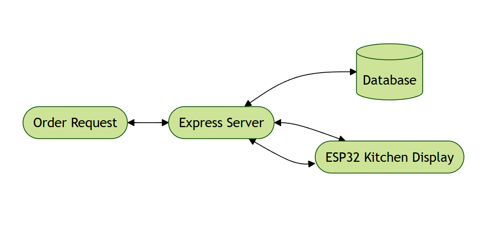
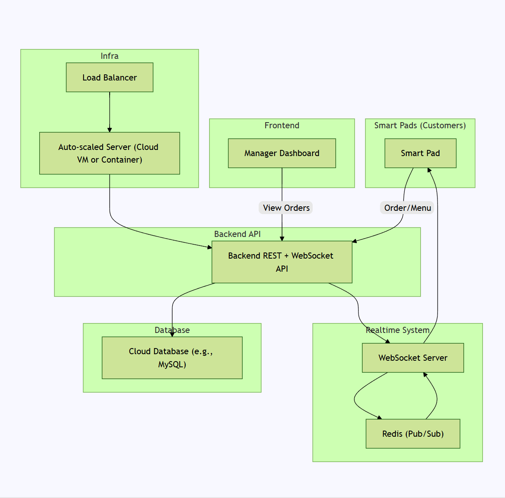

### Q1: Database schema to track users, orders, menu items, tables, payments

In the [q1.sql](q1.sql) file, we define the database schema for Bistro 92. We are using `MySQL` for our database. The schema includes the following tables:

- `tables`: Stores information about tables in the restaurant.
- `users`: Stores user information, including their role (admin or customer).
- `menu_items`: Stores information about menu items, including their price and availability.
- `orders`: Stores information about orders placed by users, including the table number and order status.
- `order_items`: Stores information about the items included in each order.
- `payments`: Stores information about payments made for orders.

### Q2: SQL query to retrieve data

In the [q2.sql](q2.sql) file, we provide the SQL query to retrieve the following information:

- The table number associated with each order.
- The order ID and the time the order was placed.
- Only orders placed within the last one hour are considered.
- A JSON array of items ordered, where each item includes:
  - The name of the menu item.
  - The quantity ordered.

### Q3: Notify kitchen staff in real-time for new orders

In the `q3` directory, we implemented a real-time notification system using `webSockets` for notifying kitchen staff about new orders. Our tech stack includes:

- `Express.js` as the server framework.
- `TypeScript` for type safety.
- `ws` as the nodejs webSocket library.
- `MySQL` for the database.

A simple diagram of the architecture is provided in the [q3_diagram](q3_diagram.png) file:

### Q4: Cloud-based system architecture

The cloud-based system architecture diagram is provided in the [q4_cloud](q4_cloud.PNG) file:

### Q5: Real-time admin/manager dashboard

We have designed a real-time admin/manager dashboard using `Next.js`. The source code can be found in the `q5` directory. The prototype dashboard has been hosted on `Vercel`, which can be accessed at [Bistro 92 Dashboard](https://bistro-92-client.vercel.app/).
